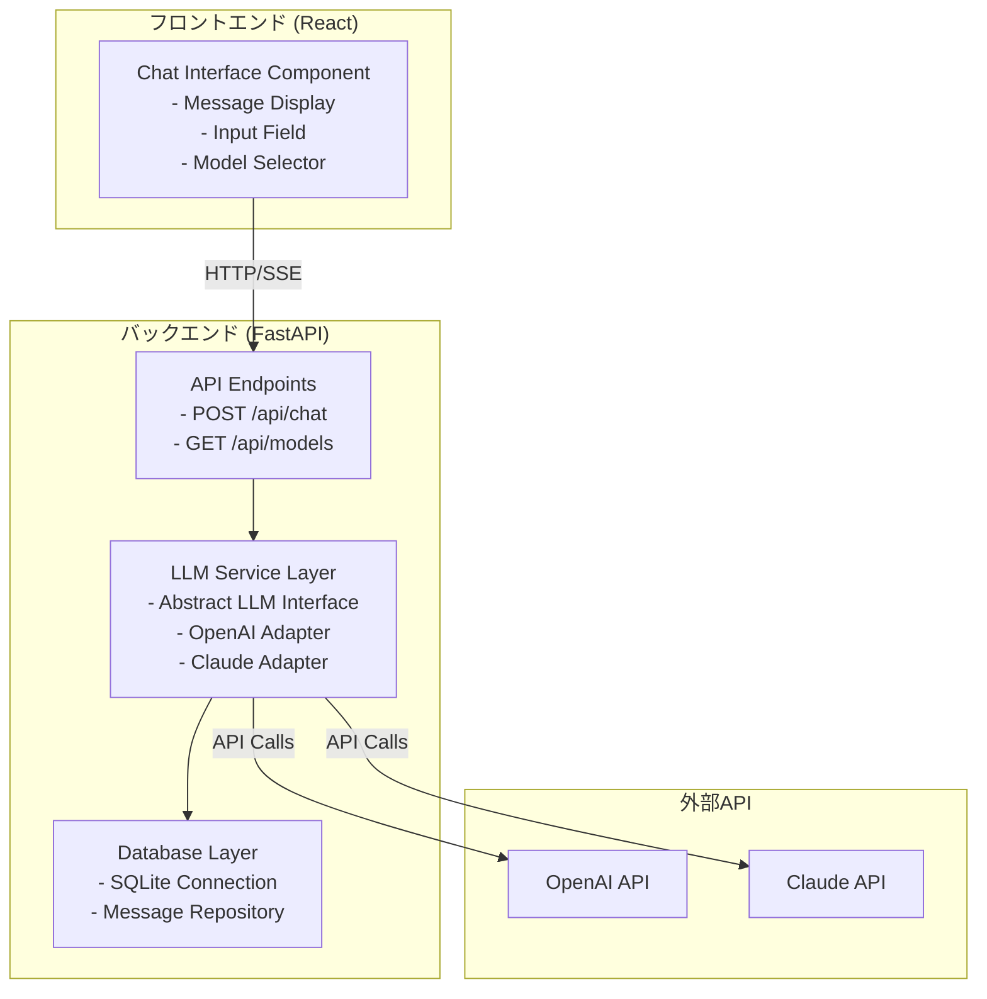

# 設計書

## 概要

本設計書は、生成AIチャットアプリケーションのMVPの技術設計を定義します。このシステムは、React + TypeScriptのフロントエンドとFastAPIのバックエンドで構成され、OpenAIとClaudeの複数のLLMモデルに対応したストリーミングチャット機能を提供します。

## アーキテクチャ

### システム構成



### 技術スタック

**フロントエンド:**
- React 18+
- TypeScript 5+
- Vite（ビルドツール）
- Fetch API（SSE通信）

**バックエンド:**
- Python 3.11+
- FastAPI 0.100+
- uvicorn（ASGIサーバー）
- SQLAlchemy 2.0+（ORM）
- openai（OpenAI Python SDK）
- anthropic（Claude Python SDK）

**データベース:**
- SQLite 3

**開発ツール:**
- uv（Pythonパッケージ管理）
- ESLint + Prettier（コード品質）

## コンポーネントとインターフェース

### フロントエンド コンポーネント

#### 1. ChatInterface Component

メインのチャットインターフェースコンポーネント。

```typescript
interface Message {
  id: string;
  role: 'user' | 'assistant';
  content: string;
  model: string;
  timestamp: Date;
}

interface ChatInterfaceProps {
  // プロップスは不要（単一セッション）
}

interface ChatInterfaceState {
  messages: Message[];
  inputValue: string;
  selectedModel: string;
  isLoading: boolean;
  error: string | null;
}
```

**責務:**
- メッセージの表示
- ユーザー入力の処理
- モデル選択の管理
- ストリーミングレスポンスの受信と表示

#### 2. MessageList Component

メッセージリストを表示するコンポーネント。

```typescript
interface MessageListProps {
  messages: Message[];
}
```

**責務:**
- メッセージの一覧表示
- 自動スクロール
- ユーザーとアシスタントのメッセージの視覚的区別

#### 3. MessageInput Component

メッセージ入力フィールドとモデル選択。

```typescript
interface MessageInputProps {
  value: string;
  selectedModel: string;
  availableModels: string[];
  isLoading: boolean;
  onSend: (message: string) => void;
  onChange: (value: string) => void;
  onModelChange: (model: string) => void;
}
```

**責務:**
- テキスト入力の管理
- 送信ボタンの制御
- モデル選択ドロップダウン

### バックエンド コンポーネント

#### 1. API Endpoints (main.py)

FastAPIのエンドポイント定義。

```python
@app.post("/api/chat")
async def chat_stream(request: ChatRequest) -> StreamingResponse:
    """
    チャットメッセージを受信し、ストリーミングレスポンスを返す
    """
    pass

@app.get("/api/models")
async def get_models() -> List[ModelInfo]:
    """
    利用可能なLLMモデルのリストを返す
    """
    pass
```

#### 2. LLM Service Layer

抽象インターフェースと具体的な実装。

```python
from abc import ABC, abstractmethod
from typing import AsyncIterator

class LLMProvider(ABC):
    """LLMプロバイダーの抽象基底クラス"""
    
    @abstractmethod
    async def stream_chat(
        self,
        messages: List[Dict[str, str]],
        model: str
    ) -> AsyncIterator[str]:
        """
        チャットメッセージをストリーミングで処理
        
        Args:
            messages: チャット履歴
            model: 使用するモデル名
            
        Yields:
            生成されたテキストのチャンク
        """
        pass

class OpenAIProvider(LLMProvider):
    """OpenAI APIの実装"""
    
    def __init__(self, api_key: str):
        self.client = OpenAI(api_key=api_key)
    
    async def stream_chat(
        self,
        messages: List[Dict[str, str]],
        model: str
    ) -> AsyncIterator[str]:
        stream = await self.client.chat.completions.create(
            model=model,
            messages=messages,
            stream=True
        )
        async for chunk in stream:
            if chunk.choices[0].delta.content:
                yield chunk.choices[0].delta.content

class ClaudeProvider(LLMProvider):
    """Claude APIの実装"""
    
    def __init__(self, api_key: str):
        self.client = Anthropic(api_key=api_key)
    
    async def stream_chat(
        self,
        messages: List[Dict[str, str]],
        model: str
    ) -> AsyncIterator[str]:
        # Claudeのメッセージ形式に変換
        claude_messages = self._convert_messages(messages)
        
        async with self.client.messages.stream(
            model=model,
            messages=claude_messages,
            max_tokens=4096
        ) as stream:
            async for text in stream.text_stream:
                yield text
    
    def _convert_messages(
        self,
        messages: List[Dict[str, str]]
    ) -> List[Dict[str, str]]:
        """OpenAI形式からClaude形式にメッセージを変換"""
        # システムメッセージの分離など
        pass

class LLMService:
    """LLMサービスのファサード"""
    
    def __init__(self):
        self.providers = {
            'openai': OpenAIProvider(os.getenv('OPENAI_API_KEY')),
            'claude': ClaudeProvider(os.getenv('ANTHROPIC_API_KEY'))
        }
        self.model_mapping = {
            'gpt-5.2': 'openai',
            'gpt-5.2-mini': 'openai',
            'claude-opus-4.5': 'claude',
            'claude-sonnet-4.5': 'claude',
            'claude-haiku-4.5': 'claude'
        }
    
    async def stream_chat(
        self,
        messages: List[Dict[str, str]],
        model: str
    ) -> AsyncIterator[str]:
        provider_name = self.model_mapping.get(model)
        if not provider_name:
            raise ValueError(f"Unknown model: {model}")
        
        provider = self.providers[provider_name]
        async for chunk in provider.stream_chat(messages, model):
            yield chunk
```

#### 3. Database Layer

SQLAlchemyを使用したデータベース層。

```python
from sqlalchemy import Column, Integer, String, DateTime, create_engine
from sqlalchemy.ext.declarative import declarative_base
from sqlalchemy.orm import sessionmaker
from datetime import datetime

Base = declarative_base()

class Message(Base):
    """メッセージモデル"""
    __tablename__ = 'messages'
    
    id = Column(Integer, primary_key=True)
    role = Column(String, nullable=False)  # 'user' or 'assistant'
    content = Column(String, nullable=False)
    model = Column(String, nullable=False)
    timestamp = Column(DateTime, default=datetime.utcnow)

class MessageRepository:
    """メッセージリポジトリ"""
    
    def __init__(self, db_url: str = "sqlite:///./chat.db"):
        self.engine = create_engine(db_url)
        Base.metadata.create_all(self.engine)
        self.SessionLocal = sessionmaker(bind=self.engine)
    
    def save_message(
        self,
        role: str,
        content: str,
        model: str
    ) -> Message:
        """メッセージを保存"""
        session = self.SessionLocal()
        try:
            message = Message(
                role=role,
                content=content,
                model=model
            )
            session.add(message)
            session.commit()
            session.refresh(message)
            return message
        finally:
            session.close()
    
    def get_all_messages(self) -> List[Message]:
        """全メッセージを取得（将来の機能拡張用）"""
        session = self.SessionLocal()
        try:
            return session.query(Message).order_by(Message.timestamp).all()
        finally:
            session.close()
```

## データモデル

### フロントエンド データモデル

```typescript
// メッセージ型
interface Message {
  id: string;              // クライアント側で生成されるユニークID
  role: 'user' | 'assistant';
  content: string;
  model: string;           // 使用されたモデル名
  timestamp: Date;
}

// チャットリクエスト型
interface ChatRequest {
  message: string;
  model: string;
  history: Message[];      // 会話履歴（コンテキスト用）
}

// モデル情報型
interface ModelInfo {
  id: string;              // 例: 'gpt-5.2'
  name: string;            // 表示名: 'GPT-5.2'
  provider: 'openai' | 'claude';
  description: string;
}
```

### バックエンド データモデル

```python
from pydantic import BaseModel
from typing import List, Literal
from datetime import datetime

class ChatMessage(BaseModel):
    """チャットメッセージ"""
    role: Literal['user', 'assistant', 'system']
    content: str

class ChatRequest(BaseModel):
    """チャットリクエスト"""
    message: str
    model: str
    history: List[ChatMessage] = []

class ModelInfo(BaseModel):
    """モデル情報"""
    id: str
    name: str
    provider: Literal['openai', 'claude']
    description: str

class StreamChunk(BaseModel):
    """ストリーミングチャンク"""
    content: str
    done: bool = False
```

### データベース スキーマ

```sql
CREATE TABLE messages (
    id INTEGER PRIMARY KEY AUTOINCREMENT,
    role TEXT NOT NULL CHECK(role IN ('user', 'assistant')),
    content TEXT NOT NULL,
    model TEXT NOT NULL,
    timestamp DATETIME DEFAULT CURRENT_TIMESTAMP
);

CREATE INDEX idx_messages_timestamp ON messages(timestamp);
```

## 正確性プロパティ

*プロパティとは、システムの全ての有効な実行において真であるべき特性や振る舞いのことです。これは人間が読める仕様と機械で検証可能な正確性保証の橋渡しとなります。*


### プロパティ 1: メッセージ送信とUI表示

*任意の*メッセージに対して、送信操作を行った後、そのメッセージがChat_Interfaceに表示され、かつAPI_Gatewayへのリクエストが送信されること

**検証: 要件 1.1**

### プロパティ 2: ストリーミングレスポンスのリアルタイム表示

*任意の*LLMレスポンスに対して、ストリーミング形式で受信したテキストが逐次的にChat_Interfaceに追加表示されること

**検証: 要件 1.2, 1.3, 4.3**

### プロパティ 3: メッセージの永続化

*任意の*完了したメッセージ（ユーザーまたはアシスタント）に対して、そのメッセージがMessage_Storeに保存されること

**検証: 要件 1.4, 3.1, 3.2**

### プロパティ 4: エラー時のユーザー通知

*任意の*メッセージ送信エラーに対して、適切なエラーメッセージがChat_Interfaceに表示され、ユーザーが再試行できる状態が維持されること

**検証: 要件 1.5, 7.5**

### プロパティ 5: モデル選択の適用

*任意の*モデル選択に対して、選択されたモデルが現在のChat_Sessionに適用され、次のメッセージ送信時に使用されること

**検証: 要件 2.2, 2.3**

### プロパティ 6: モデル選択のUI反映

*任意の*モデル変更に対して、新しいモデル選択がChat_Interfaceに視覚的に反映されること

**検証: 要件 2.4**

### プロパティ 7: 保存データの完全性

*任意の*保存されるメッセージに対して、タイムスタンプ、送信者（user/assistant）、メッセージ内容、使用モデルの全フィールドが含まれること

**検証: 要件 3.3**

### プロパティ 8: データベースエラーの透過的処理

*任意の*データベース書き込みエラーに対して、エラーがログに記録され、ユーザーは通常通りチャットを継続できること

**検証: 要件 3.4**

### プロパティ 9: SSE接続の確立

*任意の*LLM_Providerへのリクエストに対して、Server-Sent Events（SSE）を使用したストリーミング接続が確立されること

**検証: 要件 4.1**

### プロパティ 10: トークンの即座送信

*任意の*LLM_Providerが生成するトークンに対して、各トークンが即座にChat_Interfaceに送信されること

**検証: 要件 4.2**

### プロパティ 11: SSE接続のクローズ

*任意の*ストリーミング完了に対して、SSE接続が適切にクローズされること

**検証: 要件 4.4**

### プロパティ 12: ストリーミングエラーの検出と通知

*任意の*ストリーミング中の接続エラーに対して、エラーが検出され、ユーザーに通知されること

**検証: 要件 4.5**

### プロパティ 13: APIキーの使用

*任意の*LLM_Providerへのリクエストに対して、適切なAPIキーがリクエストヘッダーに含まれること

**検証: 要件 5.3**

### プロパティ 14: APIキーの非公開

*任意の*クライアントへのレスポンスに対して、APIキーが含まれていないこと

**検証: 要件 5.4**

### プロパティ 15: プロバイダー固有の形式変換

*任意の*LLM_Provider（OpenAIまたはClaude）へのリクエストに対して、そのプロバイダー固有の形式に正しく変換され、レスポンスは統一された形式でChat_Interfaceに返されること

**検証: 要件 6.2, 6.3, 6.4**

### プロパティ 16: エラー後の状態維持

*任意の*エラー発生後に、ユーザーがメッセージを再送信できる状態が維持されること

**検証: 要件 7.4, 7.5**

### プロパティ 17: 自動スクロール

*任意の*新しいメッセージ追加に対して、Chat_Interfaceが自動的に最新のメッセージまでスクロールすること

**検証: 要件 8.2**

### プロパティ 18: 送信中のUI状態

*任意の*メッセージ送信中に、送信ボタンが無効化され、ローディングインジケーターが表示されること

**検証: 要件 8.3**

### プロパティ 19: 空入力の送信防止

*任意の*空の入力フィールドに対して、送信ボタンが無効化されること

**検証: 要件 8.4**

## エラーハンドリング

### エラーの分類

1. **クライアント側エラー**
   - 入力バリデーションエラー
   - ネットワーク接続エラー
   - SSE接続エラー

2. **サーバー側エラー**
   - APIキー未設定エラー
   - LLM Provider APIエラー（レート制限、認証エラー）
   - データベースエラー
   - 予期しないエラー

### エラーハンドリング戦略

#### クライアント側

```typescript
class ChatService {
  async sendMessage(message: string, model: string): Promise<void> {
    try {
      const response = await fetch('/api/chat', {
        method: 'POST',
        headers: { 'Content-Type': 'application/json' },
        body: JSON.stringify({ message, model })
      });

      if (!response.ok) {
        throw new Error(`HTTP error! status: ${response.status}`);
      }

      // SSEストリーミング処理
      const reader = response.body?.getReader();
      const decoder = new TextDecoder();

      while (true) {
        const { done, value } = await reader.read();
        if (done) break;
        
        const chunk = decoder.decode(value);
        // チャンクを処理
      }
    } catch (error) {
      if (error instanceof TypeError) {
        // ネットワークエラー
        throw new Error('ネットワークエラーが発生しました。接続を確認してください');
      } else {
        // その他のエラー
        throw new Error('メッセージの送信に失敗しました');
      }
    }
  }
}
```

#### サーバー側

```python
from fastapi import HTTPException, status
from fastapi.responses import StreamingResponse
import logging

logger = logging.getLogger(__name__)

@app.post("/api/chat")
async def chat_stream(request: ChatRequest):
    try:
        # APIキーの確認
        if not llm_service.has_api_key(request.model):
            logger.error(f"API key not configured for model: {request.model}")
            raise HTTPException(
                status_code=status.HTTP_503_SERVICE_UNAVAILABLE,
                detail="サービスに接続できません"
            )
        
        # ストリーミングレスポンスの生成
        async def generate():
            try:
                full_response = ""
                async for chunk in llm_service.stream_chat(
                    messages=request.history + [{"role": "user", "content": request.message}],
                    model=request.model
                ):
                    full_response += chunk
                    yield f"data: {json.dumps({'content': chunk})}\n\n"
                
                # メッセージを保存
                try:
                    message_repo.save_message("user", request.message, request.model)
                    message_repo.save_message("assistant", full_response, request.model)
                except Exception as db_error:
                    logger.error(f"Database error: {db_error}")
                    # データベースエラーはユーザーに影響させない
                
                yield f"data: {json.dumps({'done': True})}\n\n"
                
            except RateLimitError:
                logger.warning("Rate limit exceeded")
                yield f"data: {json.dumps({'error': 'リクエストが多すぎます。しばらく待ってから再試行してください'})}\n\n"
            except AuthenticationError:
                logger.error("Authentication failed")
                yield f"data: {json.dumps({'error': 'サービスに接続できません'})}\n\n"
            except Exception as e:
                logger.error(f"Unexpected error: {e}")
                yield f"data: {json.dumps({'error': 'エラーが発生しました'})}\n\n"
        
        return StreamingResponse(generate(), media_type="text/event-stream")
        
    except HTTPException:
        raise
    except Exception as e:
        logger.error(f"Unexpected error in chat_stream: {e}")
        raise HTTPException(
            status_code=status.HTTP_500_INTERNAL_SERVER_ERROR,
            detail="エラーが発生しました"
        )
```

### ログ記録

```python
import logging
from logging.handlers import RotatingFileHandler

# ログ設定
logging.basicConfig(
    level=logging.INFO,
    format='%(asctime)s - %(name)s - %(levelname)s - %(message)s',
    handlers=[
        RotatingFileHandler('app.log', maxBytes=10485760, backupCount=5),
        logging.StreamHandler()
    ]
)
```

## テスト戦略

### デュアルテストアプローチ

本プロジェクトでは、ユニットテストとプロパティベーステストの両方を使用します：

- **ユニットテスト**: 特定の例、エッジケース、エラー条件を検証
- **プロパティベーステスト**: 全ての入力に対する普遍的なプロパティを検証

両者は補完的であり、包括的なカバレッジを実現します。

### フロントエンド テスト

**テストフレームワーク:**
- Jest（テストランナー）
- React Testing Library（コンポーネントテスト）
- MSW（Mock Service Worker）（APIモック）

**テスト対象:**

1. **コンポーネントのユニットテスト**
   - メッセージ表示の正確性
   - 入力バリデーション
   - モデル選択の動作
   - エラー表示

2. **統合テスト**
   - チャットフローの完全な動作
   - ストリーミングレスポンスの受信と表示
   - エラーハンドリング

**例:**

```typescript
describe('ChatInterface', () => {
  it('should disable send button when input is empty', () => {
    render(<ChatInterface />);
    const sendButton = screen.getByRole('button', { name: /送信/i });
    expect(sendButton).toBeDisabled();
  });

  it('should display user message after sending', async () => {
    render(<ChatInterface />);
    const input = screen.getByRole('textbox');
    const sendButton = screen.getByRole('button', { name: /送信/i });
    
    fireEvent.change(input, { target: { value: 'Hello' } });
    fireEvent.click(sendButton);
    
    expect(await screen.findByText('Hello')).toBeInTheDocument();
  });
});
```

### バックエンド テスト

**テストフレームワーク:**
- pytest（テストランナー）
- pytest-asyncio（非同期テスト）
- Hypothesis（プロパティベーステスト）

**テスト対象:**

1. **ユニットテスト**
   - LLMプロバイダーアダプターの変換ロジック
   - データベース操作
   - エラーハンドリング

2. **プロパティベーステスト**
   - メッセージの永続化（プロパティ3、7）
   - プロバイダー固有の形式変換（プロパティ15）
   - APIキーの非公開（プロパティ14）

3. **統合テスト**
   - APIエンドポイントの動作
   - ストリーミングレスポンス
   - エラーレスポンス

**プロパティベーステスト設定:**
- 各プロパティテストは最低100回の反復を実行
- 各テストは設計書のプロパティを参照するタグを含む
- タグ形式: `# Feature: ai-chat-mvp, Property {番号}: {プロパティテキスト}`

**例:**

```python
import pytest
from hypothesis import given, strategies as st

# Feature: ai-chat-mvp, Property 3: メッセージの永続化
@given(
    role=st.sampled_from(['user', 'assistant']),
    content=st.text(min_size=1),
    model=st.sampled_from(['gpt-5.2', 'gpt-5.2-mini', 'claude-opus-4.5', 'claude-sonnet-4.5', 'claude-haiku-4.5'])
)
def test_message_persistence(role, content, model):
    """任意の完了したメッセージに対して、そのメッセージがMessage_Storeに保存されること"""
    repo = MessageRepository(db_url="sqlite:///:memory:")
    
    # メッセージを保存
    saved_message = repo.save_message(role, content, model)
    
    # 保存されたメッセージを取得
    messages = repo.get_all_messages()
    
    # 検証
    assert len(messages) == 1
    assert messages[0].role == role
    assert messages[0].content == content
    assert messages[0].model == model

# Feature: ai-chat-mvp, Property 7: 保存データの完全性
@given(
    role=st.sampled_from(['user', 'assistant']),
    content=st.text(min_size=1),
    model=st.sampled_from(['gpt-5.2', 'gpt-5.2-mini', 'claude-opus-4.5', 'claude-sonnet-4.5', 'claude-haiku-4.5'])
)
def test_saved_message_completeness(role, content, model):
    """任意の保存されるメッセージに対して、全フィールドが含まれること"""
    repo = MessageRepository(db_url="sqlite:///:memory:")
    
    saved_message = repo.save_message(role, content, model)
    
    # 全フィールドの存在を確認
    assert saved_message.id is not None
    assert saved_message.role == role
    assert saved_message.content == content
    assert saved_message.model == model
    assert saved_message.timestamp is not None

# ユニットテスト例
@pytest.mark.asyncio
async def test_openai_provider_streaming():
    """OpenAIプロバイダーがストリーミングレスポンスを返すこと"""
    provider = OpenAIProvider(api_key="test-key")
    
    messages = [{"role": "user", "content": "Hello"}]
    chunks = []
    
    async for chunk in provider.stream_chat(messages, "gpt-5.2"):
  